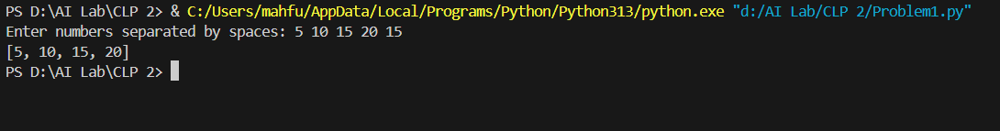
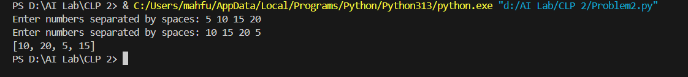
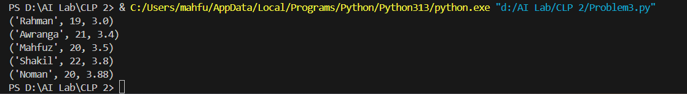
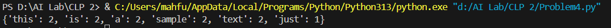
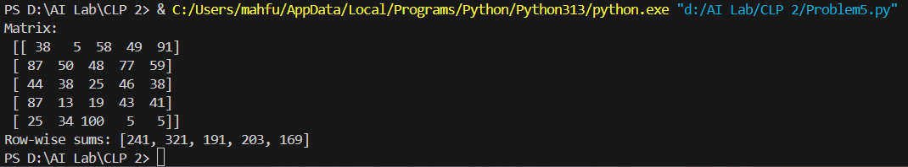
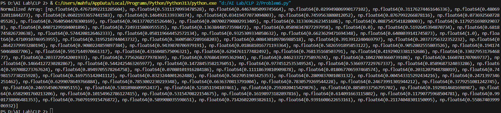
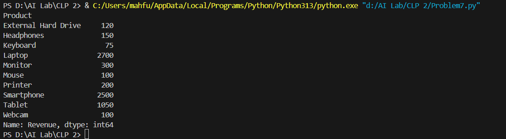
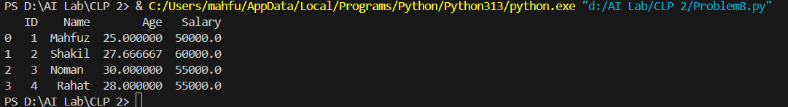
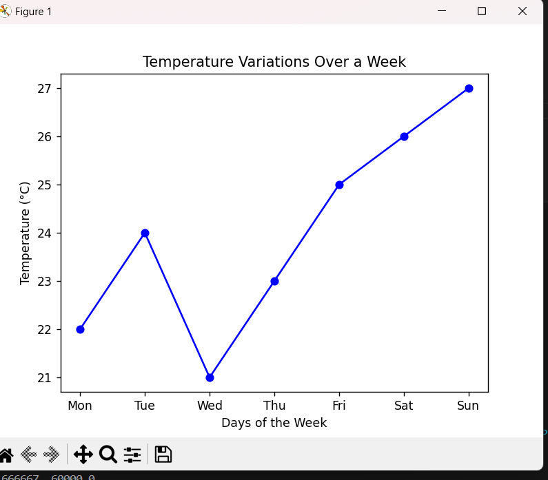
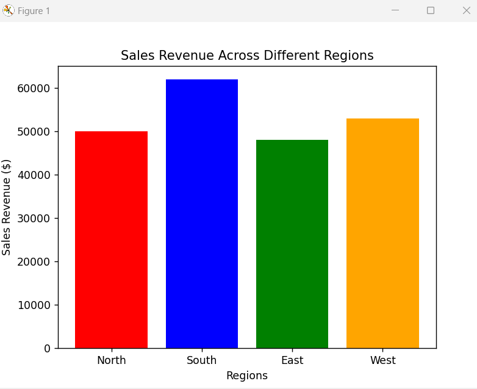

Problem1: Given a list of numbers, remove duplicates and sort in ascending order.

Problem2:  Find the common elements between two lists using sets.

Problem3: Create a tuple of student records (name, age, grade) and sort by grade.

Problem4: Count word occurrences in a given text and store them in a dictionary.

Problem 5: Generate a 5x5 matrix of random integers and compute row-wise sums.

Problem6:  Create an array of 100 random values and normalize them between 0 and 1.

Problem7:  Load a CSV file of sales data and compute total revenue per product.

Problem8: Fill missing values in a dataset with column-wise means.

Problem9:  Plot a line graph showing temperature variations over a week.

Problem10: Create a bar chart comparing sales revenue across different regions.

