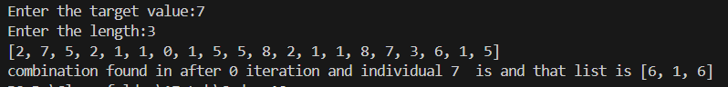
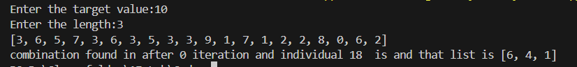

**Problem Statement:** Given a target integer T and a fixed list length k, evolve a list of k numbers (0–9) sum of the first two numbers equals the target T.\
**Test Case1**\
\

**Test case2:**\
\

