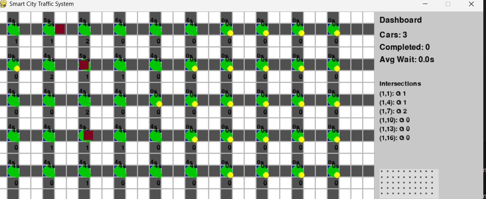
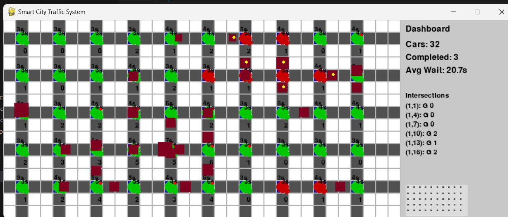
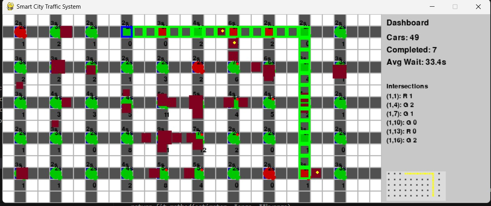

# Smart City Traffic System 🚦🚗

A Python-based traffic simulation system that models vehicle behaviors, intelligent traffic lights, and dynamic routing in a simulated city environment.

## Features ✨

- **Multi-type Vehicle Simulation**  
  - Cars, buses, emergency vehicles, trucks, and motorcycles
  - Unique behaviors for each vehicle type

- **Intelligent Traffic Control**  
  - Adaptive traffic light timing
  - Emergency vehicle priority
  - Traffic density-based optimizations
  - Coordinated intersection groups

- **Advanced Routing System**  
  - Iterative Deepening Search pathfinding
  - Traffic-aware route suggestions
  - Dynamic congestion avoidance

- **Comprehensive Visualization**  
  - Real-time statistics dashboard
  - Traffic density heatmap

## Installation 🛠️

1. pygame, numpy

## Project Output
 **Starting time**

**After Sometime**

**Path finding**

 
  
