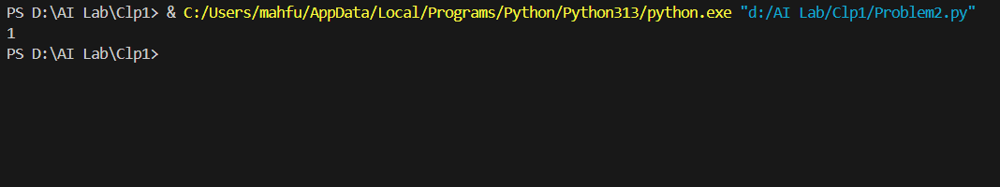
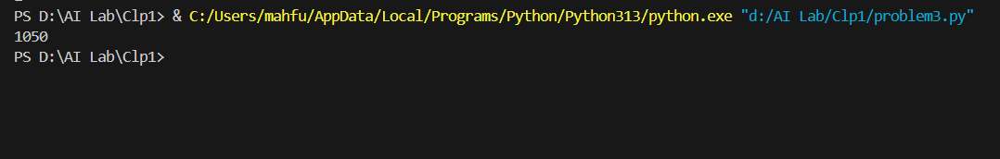
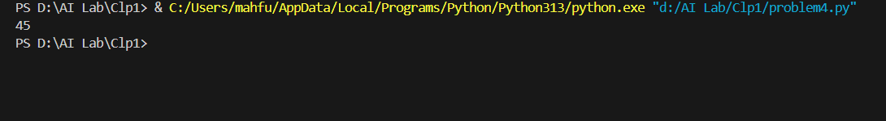
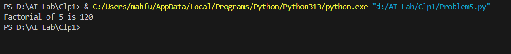
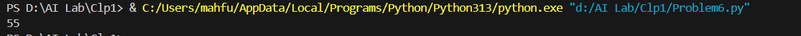
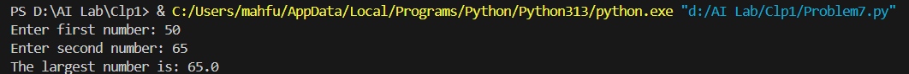
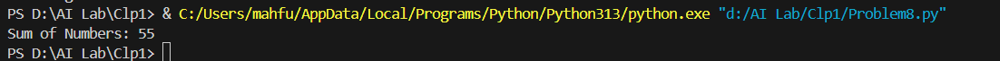

Problem1: Write a python program to find the sum of odd and even numbers from a set of numbers

Problem2:Write a python program to find the smallest number from a set of numbers

Problem3: Write a python program to find the sum of all numbers between 50 and 100, which are divisible by 3 and
not divisible by 5

Problem4: Write a python program to find the second highest number from a set of numbers

Problem5: Write a python program to find the factorial of a number using for loop

Problem6: Write a python program to generate Fibonacci series

Problem7: Write a python program to find the largest number between two numbers using function

Problem8: Write a python program to find the sum of the numbers passed as parameters

